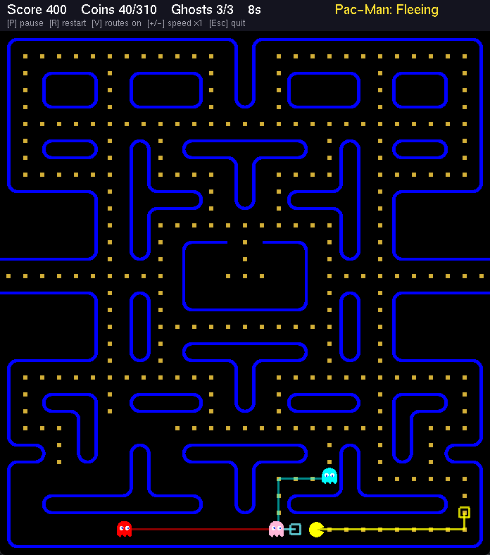
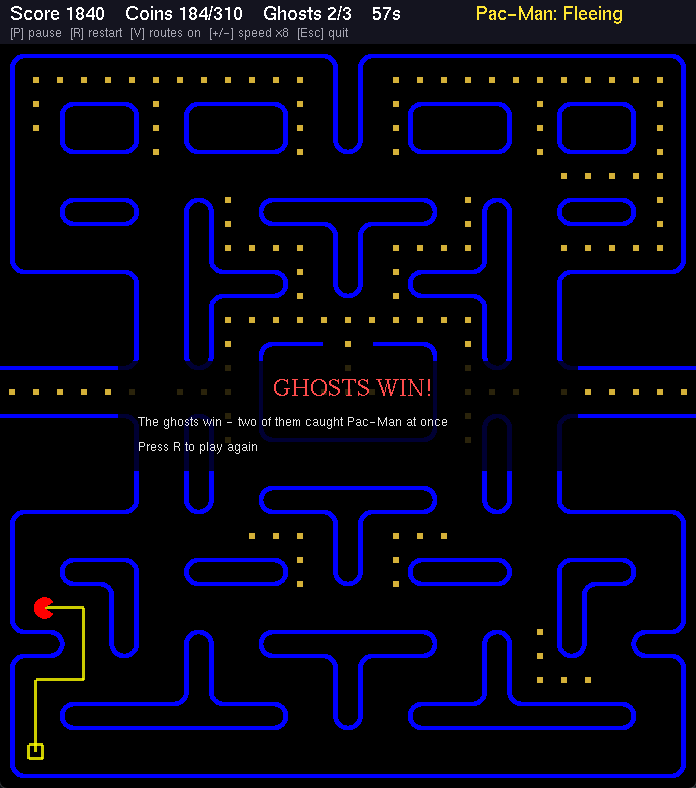

# AI Pac-Man

Pac-Man in C++ / OpenGL where both Pac-Man and the ghosts are controlled by the computer.
Started as a project for the Artificial Intelligence course at Afeka College of Engineering.



The lines on the screen are the routes each character is planning (press V to hide them).

## How it works

**Pac-Man** has two states (state machine):
- **Collecting coins** - BFS to find the closest coin, then A* to get there. Cells near ghosts get a higher cost so he tries to go around them.
- **Fleeing** - when a ghost gets within 5 steps. I run a BFS from all the ghosts to know how fast a ghost can get to every cell, and then a BFS from Pac-Man that only goes into cells he reaches before the ghosts. From those he goes to the one farthest from the ghosts (and not a dead end). He goes back to collecting coins when all ghosts are more than 8 steps away.

**Ghosts** use A* to chase Pac-Man and recalculate the path on every cell. If a cell is already on another ghost's path it costs more, so the ghosts spread out and come from different sides instead of walking in a line. Pinky aims a few cells ahead of Pac-Man to cut him off.

## Rules

- When a ghost catches Pac-Man they fight for 3 seconds. If it's just one ghost, the ghost loses and disappears.
- If a second ghost catches him during the fight, the ghosts win.
- Pac-Man wins if he eats all the coins or beats all the ghosts.

In my tests it comes out roughly 55/45 for Pac-Man, a game takes about a minute.



## Controls

- `P` / `Space` - pause
- `R` - restart
- `V` - show/hide routes
- `+` / `-` - speed (x1 to x8)
- `Esc` - quit

## Build

Needs Windows and Visual Studio 2022 (C++ desktop workload). Everything else is in the repo.

Open `PacMan.sln`, choose **x86** (freeglut here is 32 bit) and run.

Or from a developer command prompt:

```
msbuild PacMan.sln /p:Configuration=Release /p:Platform=x86
bin\Release\AIPacMan.exe
```

## Files

- `src/main.cpp` - window, game loop, HUD, keyboard
- `src/Game` - game state and rules
- `src/Maze` - the map and coins
- `src/Pathfinding` - A* and BFS
- `src/NPC` - base class for characters (movement on the grid)
- `src/Pacman`, `src/WanderingState`, `src/RetreatState` - Pac-Man and his states
- `src/Ghost` - ghosts
- `src/Constants.h` - sizes, speeds and AI parameters

Libraries: freeglut, stb_image.
